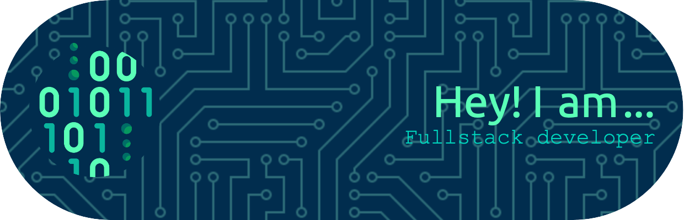

<h1> Welcome to my Digital Home! 👋 </h1>

<h2> About Me </h2>

  I am a passionate and proactive computer science enthusiast, currently in my second year pursuing a BSc in Computer Science at the University of Leeds. With a solid foundation in web development and a keen interest in cutting-edge technologies, I am excited to contribute to innovative projects and explore new challenges in the software development field. 🚀

<h2> Projects </h2>

<h3> Konkani Language Dictionary </h3>
<ul>
  <li>Developed a user-friendly foreign language dictionary and web app using React, Redux State Management, and MongoDB.</li>
  <li>Implemented secure back-end authentication, authorization, and routing to protect user data and enhance application security.</li>
  <li>Demonstrated skills in database management and project deployment with Git. 🚀</li>
</ul>

<h3> Pathfinding Algorithm Simulator </h3>
<ul>
  <li>Designed and built a maze-generation visualization web app for an A-Level project.</li>
  <li>Utilized A*, Dijkstra's, and DFS algorithms to develop dynamic, real-time traversals with custom CSS animations.</li>
  <li>Demonstrated algorithm implementation, UI design, and real-time data visualization skills. 🧠</li>
</ul>

<h3> Website Development - Various Frameworks </h3>
<ul>
  <li>Flask and Django:
    <ul>
      <li>Designed Flask frontend for an AI-trained language translation model for Latin.</li>
      <li>Created a website with dynamically deployed content using the Django framework.</li>
    </ul>
  </li>
  <li>NextJS:
    <ul>
      <li>Developed a website with TypeScript, MongoDB, Tailwind, and Next App Router, implementing routing and data-fetching, and authentication using Google OAuth. Used SSR and SSG to optimize performance and SEO.</li>
    </ul>
  </li>
  <li>HTML5, CSS3, Bootstrap:
    <ul>
      <li>Created basic static websites for school projects and friends.</li>
    </ul>
  </li>
  <li>Wordpress:
    <ul>
      <li>Designed a Wordpress website for a company using themes, plugins, and custom CSS. 🌐</li>
    </ul>
  </li>
</ul>

<h2> Technologies & Languages I Use </h2>

